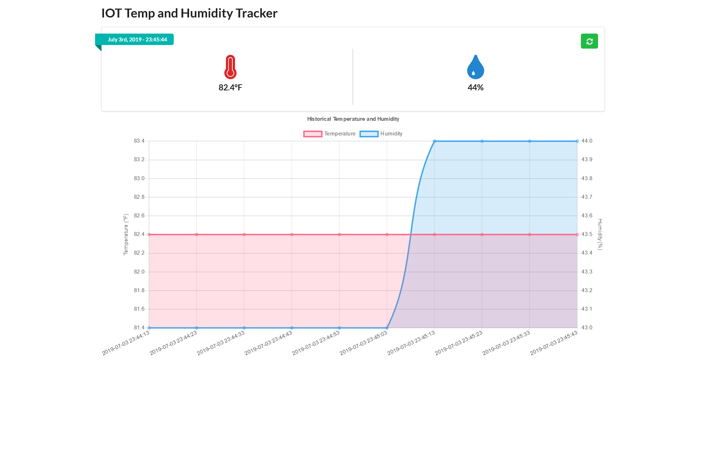
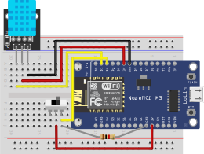

# Temp and Humidity Tracker IOT

## Overview
Embedded code using Mongoose OS which keeps track of current temperature and humidity. Device used is the NodeMCU DevKit version 1.0.

This DevKit contains a built in ESP8266 Wifi Chip.

Temperature and Humidity history is stored in onboard flash. Can be accessed/dumped by accessing embedded webserver. Period and number of historical data points and be adjusted via the mos.yml config file.

Humidity/Temperature sensor used is a DHT11.

## Web Interface
- Displays current temperature and humidity values.
- Displays a history of recorded temperature and humidity values.
- CSS Framework: [Semantic UI (2.4.2)](https://semantic-ui.com/)
- Chart Framework: [Chart.js (2.8.0)](https://www.chartjs.org/)



## Schematic


## Cloning Repo
This repository contains Mongoose OS as a submodule for auto-complete purposes.
1) `git clone https://github.com/J-Pai/TempHumidityIOT.git` - Clone the repo.
2) `cd TempHumidityIOT` - CD into repo.
3) git submodule update --init --recursive` - Bringing in Mongoose OS for auto-complete purposes.

## Build, Flash, Use
1) `mos build` - Build code and generate fw.zip file.
2) `mos flash` - Flash onto ESP8266 board.
3) `mos wifi <SSID> <PASSWD>` - Setup Wifi connection.
4) `mos console --set-control-lines=false` - Watch for SSID and assigned IP address to connect to.

   `--set-control-lines=false` prevents `mos console` from reseting the device.

## Configuration Options
```
mos wifi <SSID> <PASSWD>
mos config-set app.dht.fahrenheit=false
mos config-set app.silent=false
mos call Sys.GetInfo
mos console
```

## Documentation
### Hardware/OS Documentation
- https://github.com/nodemcu/nodemcu-devkit-v1.0
- https://nodemcu.readthedocs.io/en/master/
- https://github.com/cesanta/mongoose-os
- https://mongoose-os.com/docs/mongoose-os/quickstart/setup.md
### Web App Documentation
- https://semantic-ui.com/introduction/getting-started.html
- https://www.chartjs.org/docs/latest/
- https://momentjs.com/docs/
